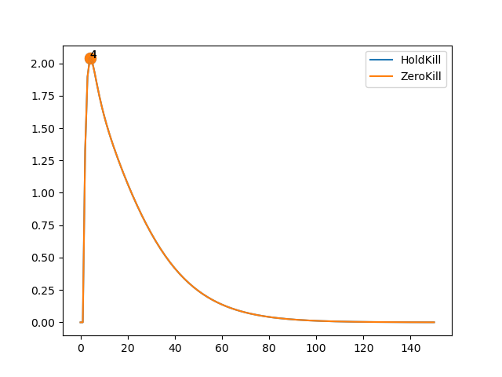

# Report: DC Motor

## Parameters

```sh
* Initial Set: [[10,10],[10,10]]
* Time Bound: 150
```

## Report: Using Uncertain Linear Systems

* Table



* Note: Two of the policies were dropped due to plot skewing.

### Detailed Report

```sh
>> REPORT.	Method: ULS.	Policy:  HoldKill .
>> STATUS: Computing Reachable Sets . . .
	Time Taken:  2.7985076904296875
>> STATUS: Reachable Sets Computed!
>> STATUS: Computing Deviations . . .
	Time Taken:  1.8085722923278809
>> STATUS: Deviations Computed!
	Max Deviation:  2.0372777067240837 ;	 At time step:  4
	Total Time Taken:  4.631383895874023
>> End of Report!

-----------

>> REPORT.	Method: ULS.	Policy:  ZeroKill .
>> STATUS: Computing Reachable Sets . . .
	Time Taken:  2.803809642791748
>> STATUS: Reachable Sets Computed!
>> STATUS: Computing Deviations . . .
	Time Taken:  1.8675806522369385
>> STATUS: Deviations Computed!
	Max Deviation:  2.0372777067240837 ;	 At time step:  4
	Total Time Taken:  4.673230886459351
>> End of Report!

-----------

>> REPORT.	Method: ULS.	Policy:  HoldSkip .
>> STATUS: Computing Reachable Sets . . .
	Time Taken:  31.027464389801025
>> STATUS: Reachable Sets Computed!
>> STATUS: Computing Deviations . . .
	Time Taken:  16.088818788528442
>> STATUS: Deviations Computed!
	Max Deviation:  6410696260328.144 ;	 At time step:  150
	Total Time Taken:  47.11883854866028
>> End of Report!

-----------

>> REPORT.	Method: ULS.	Policy:  HoldSkipAny .
>> STATUS: Computing Reachable Sets . . .
	Time Taken:  16.67229390144348
>> STATUS: Reachable Sets Computed!
>> STATUS: Computing Deviations . . .
	Time Taken:  6.287854194641113
>> STATUS: Deviations Computed!
	Max Deviation:  4.545056023539982e+25 ;	 At time step:  150
	Total Time Taken:  22.962594032287598
>> End of Report!

-----------
```

## Report: Using Generalized Recurrence Relations

* Table
* Max Deadline Miss: 4


### Detailed Report

```sh
>> REPORT.	Method: Recurrence Relation.	Policy:  HoldKill .	Max Deadline Miss:  3
>> STATUS: Computing Reachable Sets . . .
	Time Taken:  0.25730323791503906
>> STATUS: Reachable Sets Computed!
>> STATUS: Computing Deviations . . .
	Time Taken:  0.4684751033782959
>> STATUS: Deviations Computed!
	Max Deviation:  2.0372777067240815 ;	 At time step:  4
	Total Time Taken:  0.7550184726715088
>> End of Report!

-----------

>> REPORT.	Method: Recurrence Relation.	Policy:  ZeroKill .	Max Deadline Miss:  3
>> STATUS: Computing Reachable Sets . . .
	Time Taken:  0.2610435485839844
>> STATUS: Reachable Sets Computed!
>> STATUS: Computing Deviations . . .
	Time Taken:  0.47759127616882324
>> STATUS: Deviations Computed!
	Max Deviation:  2.0372777067240815 ;	 At time step:  4
	Total Time Taken:  0.7403576374053955
>> End of Report!

-----------

>> REPORT.	Method: Recurrence Relation.	Policy:  HoldSkip .	Max Deadline Miss:  3
>> STATUS: Computing Reachable Sets . . .
	Time Taken:  1.2957615852355957
>> STATUS: Reachable Sets Computed!
>> STATUS: Computing Deviations . . .
	Time Taken:  1.5597734451293945
>> STATUS: Deviations Computed!
	Max Deviation:  1.897566590828919 ;	 At time step:  4
	Total Time Taken:  2.857553482055664
>> End of Report!

-----------

>> REPORT.	Method: Recurrence Relation.	Policy:  HoldSkipAny .	Max Deadline Miss:  3
>> STATUS: Computing Reachable Sets . . .
	Time Taken:  0.4896402359008789
>> STATUS: Reachable Sets Computed!
>> STATUS: Computing Deviations . . .
	Time Taken:  0.953507661819458
>> STATUS: Deviations Computed!
	Max Deviation:  1.897566590828919 ;	 At time step:  4
	Total Time Taken:  1.4453158378601074
>> End of Report!

-----------
```

## Report: Using Generalized Recurrence Relations on Hold-Skip-Any

* Comparing the effect of deadline misses


* So Hold&Kill and Zero&Kill is better, right?

### Detailed Report

```sh
>> REPORT.	Method: Recurrence Relation.	Policy:  HoldSkipAny .	Max Deadline Miss:  2
>> STATUS: Computing Reachable Sets . . .
	Time Taken:  0.31814074516296387
>> STATUS: Reachable Sets Computed!
>> STATUS: Computing Deviations . . .
	Time Taken:  0.6257350444793701
>> STATUS: Deviations Computed!
	Max Deviation:  1.791379953474675 ;	 At time step:  3
	Total Time Taken:  0.9705982208251953
>> End of Report!

-----------

>> REPORT.	Method: Recurrence Relation.	Policy:  HoldSkipAny .	Max Deadline Miss:  4
>> STATUS: Computing Reachable Sets . . .
	Time Taken:  0.5374925136566162
>> STATUS: Reachable Sets Computed!
>> STATUS: Computing Deviations . . .
	Time Taken:  1.071831464767456
>> STATUS: Deviations Computed!
	Max Deviation:  1.9697615725709692 ;	 At time step:  10
	Total Time Taken:  1.6113216876983643
>> End of Report!

-----------

>> REPORT.	Method: Recurrence Relation.	Policy:  HoldSkipAny .	Max Deadline Miss:  8
>> STATUS: Computing Reachable Sets . . .
	Time Taken:  0.9962079524993896
>> STATUS: Reachable Sets Computed!
>> STATUS: Computing Deviations . . .
	Time Taken:  2.0224573612213135
>> STATUS: Deviations Computed!
	Max Deviation:  2.95240222850406 ;	 At time step:  18
	Total Time Taken:  3.020772933959961
>> End of Report!

-----------

>> REPORT.	Method: Recurrence Relation.	Policy:  HoldSkipAny .	Max Deadline Miss:  16
>> STATUS: Computing Reachable Sets . . .
	Time Taken:  1.8849682807922363
>> STATUS: Reachable Sets Computed!
>> STATUS: Computing Deviations . . .
	Time Taken:  3.7091805934906006
>> STATUS: Deviations Computed!
	Max Deviation:  4.09577302012779 ;	 At time step:  34
	Total Time Taken:  5.596181154251099
>> End of Report!

-----------
```

