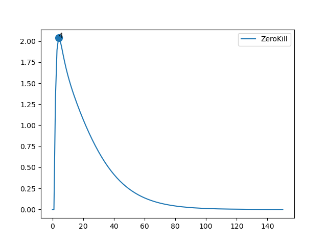
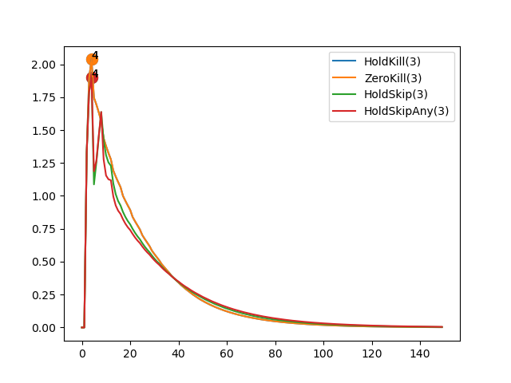
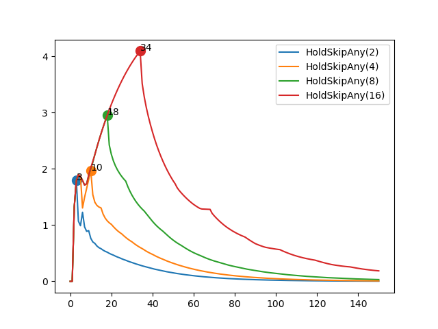

# Report: DC Motor

## Parameters

```sh
* Initial Set: [[10,10],[10,10]]
* Time Bound: 150
```

## Report: Using Uncertain Linear Systems

* Table



* Note: Three policies were dropped due to plot skewing.

### Detailed Report

```sh
>> REPORT.	Method: ULS.	Policy:  HoldKill .
>> STATUS: Computing Reachable Sets . . .
	Time Taken:  3.23470139503479
>> STATUS: Reachable Sets Computed!
>> STATUS: Computing Deviations . . .
	Time Taken:  1.9854342937469482
>> STATUS: Deviations Computed!
	Max Deviation:  778288.8450822359 ;	 At time step:  150
	Total Time Taken:  5.243410348892212
>> End of Report!

-----------

>> REPORT.	Method: ULS.	Policy:  ZeroKill .
>> STATUS: Computing Reachable Sets . . .
	Time Taken:  3.1412301063537598
>> STATUS: Reachable Sets Computed!
>> STATUS: Computing Deviations . . .
	Time Taken:  2.0742733478546143
>> STATUS: Deviations Computed!
	Max Deviation:  2.0372777067240837 ;	 At time step:  4
	Total Time Taken:  5.217357635498047
>> End of Report!

-----------

>> REPORT.	Method: ULS.	Policy:  HoldSkip .
>> STATUS: Computing Reachable Sets . . .
	Time Taken:  33.36308407783508
>> STATUS: Reachable Sets Computed!
>> STATUS: Computing Deviations . . .
	Time Taken:  16.193226099014282
>> STATUS: Deviations Computed!
	Max Deviation:  6410696260328.144 ;	 At time step:  150
	Total Time Taken:  49.55900979042053
>> End of Report!

-----------

>> REPORT.	Method: ULS.	Policy:  HoldSkipAny .
>> STATUS: Computing Reachable Sets . . .
	Time Taken:  16.35537815093994
>> STATUS: Reachable Sets Computed!
>> STATUS: Computing Deviations . . .
	Time Taken:  5.884514808654785
>> STATUS: Deviations Computed!
	Max Deviation:  4.545056023539982e+25 ;	 At time step:  150
	Total Time Taken:  22.242257833480835
>> End of Report!

-----------
```

## Report: Using Generalized Recurrence Relations

* Table
* Max Deadline Miss: 3



### Detailed Report

```sh
>> REPORT.	Method: Recurrence Relation.	Policy:  HoldKill .	Max Deadline Miss:  3
>> STATUS: Computing Reachable Sets . . .
	Time Taken:  0.21532511711120605
>> STATUS: Reachable Sets Computed!
>> STATUS: Computing Deviations . . .
	Time Taken:  0.4083552360534668
>> STATUS: Deviations Computed!
	Max Deviation:  2.0372777067240815 ;	 At time step:  4
	Total Time Taken:  0.6464395523071289
>> End of Report!

-----------

>> REPORT.	Method: Recurrence Relation.	Policy:  ZeroKill .	Max Deadline Miss:  3
>> STATUS: Computing Reachable Sets . . .
	Time Taken:  0.2263948917388916
>> STATUS: Reachable Sets Computed!
>> STATUS: Computing Deviations . . .
	Time Taken:  0.39740681648254395
>> STATUS: Deviations Computed!
	Max Deviation:  2.0372777067240815 ;	 At time step:  4
	Total Time Taken:  0.6253190040588379
>> End of Report!

-----------

>> REPORT.	Method: Recurrence Relation.	Policy:  HoldSkip .	Max Deadline Miss:  3
>> STATUS: Computing Reachable Sets . . .
	Time Taken:  1.1326165199279785
>> STATUS: Reachable Sets Computed!
>> STATUS: Computing Deviations . . .
	Time Taken:  1.331064224243164
>> STATUS: Deviations Computed!
	Max Deviation:  1.897566590828919 ;	 At time step:  4
	Total Time Taken:  2.46549654006958
>> End of Report!

-----------

>> REPORT.	Method: Recurrence Relation.	Policy:  HoldSkipAny .	Max Deadline Miss:  3
>> STATUS: Computing Reachable Sets . . .
	Time Taken:  0.42230725288391113
>> STATUS: Reachable Sets Computed!
>> STATUS: Computing Deviations . . .
	Time Taken:  0.8177182674407959
>> STATUS: Deviations Computed!
	Max Deviation:  1.897566590828919 ;	 At time step:  4
	Total Time Taken:  1.2419521808624268
>> End of Report!

-----------
```

## Report: Using Generalized Recurrence Relations on Hold-Skip-Any

* Comparing the effect of deadline misses



### Detailed Report

```sh
>> REPORT.	Method: Recurrence Relation.	Policy:  HoldKill .	Max Deadline Miss:  3
>> STATUS: Computing Reachable Sets . . .
	Time Taken:  0.21532511711120605
>> STATUS: Reachable Sets Computed!
>> STATUS: Computing Deviations . . .
	Time Taken:  0.4083552360534668
>> STATUS: Deviations Computed!
	Max Deviation:  2.0372777067240815 ;	 At time step:  4
	Total Time Taken:  0.6464395523071289
>> End of Report!

-----------

>> REPORT.	Method: Recurrence Relation.	Policy:  ZeroKill .	Max Deadline Miss:  3
>> STATUS: Computing Reachable Sets . . .
	Time Taken:  0.2263948917388916
>> STATUS: Reachable Sets Computed!
>> STATUS: Computing Deviations . . .
	Time Taken:  0.39740681648254395
>> STATUS: Deviations Computed!
	Max Deviation:  2.0372777067240815 ;	 At time step:  4
	Total Time Taken:  0.6253190040588379
>> End of Report!

-----------

>> REPORT.	Method: Recurrence Relation.	Policy:  HoldSkip .	Max Deadline Miss:  3
>> STATUS: Computing Reachable Sets . . .
	Time Taken:  1.1326165199279785
>> STATUS: Reachable Sets Computed!
>> STATUS: Computing Deviations . . .
	Time Taken:  1.331064224243164
>> STATUS: Deviations Computed!
	Max Deviation:  1.897566590828919 ;	 At time step:  4
	Total Time Taken:  2.46549654006958
>> End of Report!

-----------

>> REPORT.	Method: Recurrence Relation.	Policy:  HoldSkipAny .	Max Deadline Miss:  3
>> STATUS: Computing Reachable Sets . . .
	Time Taken:  0.42230725288391113
>> STATUS: Reachable Sets Computed!
>> STATUS: Computing Deviations . . .
	Time Taken:  0.8177182674407959
>> STATUS: Deviations Computed!
	Max Deviation:  1.897566590828919 ;	 At time step:  4
	Total Time Taken:  1.2419521808624268
>> End of Report!

-----------
```

