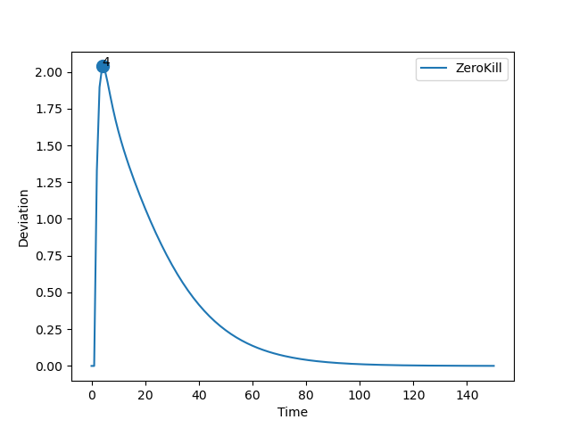
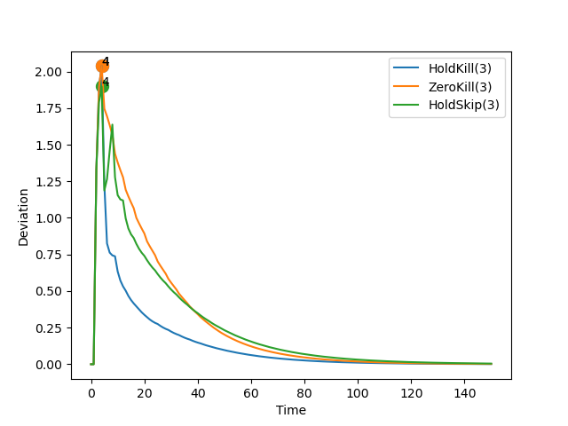
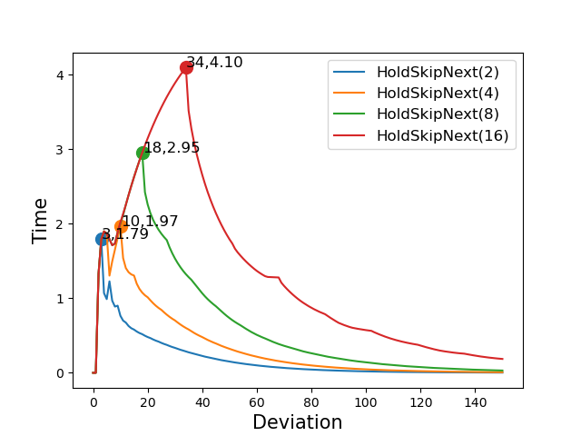
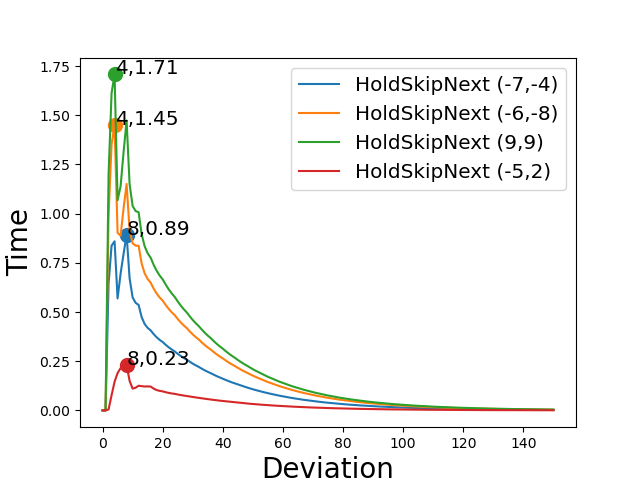

# Report: RC

## Parameters

```sh
* Initial Set: [[10,10],[10,10]]
* Time Bound: 150
```

## Report: Using Uncertain Linear Systems

* Table



* Note: Three policies were dropped due to plot skewing.

### Detailed Report

```sh
>> REPORT.	Method: ULS.	Policy:  HoldKill .
>> STATUS: Computing Reachable Sets . . .
	Time Taken:  3.1455304622650146
>> STATUS: Reachable Sets Computed!
>> STATUS: Computing Deviations . . .
	Time Taken:  1.8531181812286377
>> STATUS: Deviations Computed!
	Max Deviation:  778288.8450822359 ;	 At time step:  150
	Total Time Taken:  5.0211403369903564
>> End of Report!

-----------

>> REPORT.	Method: ULS.	Policy:  ZeroKill .
>> STATUS: Computing Reachable Sets . . .
	Time Taken:  2.7814736366271973
>> STATUS: Reachable Sets Computed!
>> STATUS: Computing Deviations . . .
	Time Taken:  2.1270272731781006
>> STATUS: Deviations Computed!
	Max Deviation:  2.0372777067240837 ;	 At time step:  4
	Total Time Taken:  4.910223722457886
>> End of Report!

-----------

>> REPORT.	Method: ULS.	Policy:  HoldSkipAny .
>> STATUS: Computing Reachable Sets . . .
	Time Taken:  15.1743004322052
>> STATUS: Reachable Sets Computed!
>> STATUS: Computing Deviations . . .
	Time Taken:  5.722458124160767
>> STATUS: Deviations Computed!
	Max Deviation:  4.545056023539982e+25 ;	 At time step:  150
	Total Time Taken:  20.898914337158203
>> End of Report!

-----------
```

## Report: Using Generalized Recurrence Relations

* Table
* Max Deadline Miss: 3



### Detailed Report

```sh
>> REPORT.	Method: Recurrence Relation.	Policy:  HoldKill .	Max Deadline Miss:  3
>> STATUS: Computing Reachable Sets . . .
	Time Taken:  0.22995495796203613
>> STATUS: Reachable Sets Computed!
>> STATUS: Computing Deviations . . .
	Time Taken:  0.41322851181030273
>> STATUS: Deviations Computed!
	Max Deviation:  2.0372777067240815 ;	 At time step:  4
	Total Time Taken:  0.6669631004333496
>> End of Report!

-----------

>> REPORT.	Method: Recurrence Relation.	Policy:  ZeroKill .	Max Deadline Miss:  3
>> STATUS: Computing Reachable Sets . . .
	Time Taken:  0.23108625411987305
>> STATUS: Reachable Sets Computed!
>> STATUS: Computing Deviations . . .
	Time Taken:  0.39871978759765625
>> STATUS: Deviations Computed!
	Max Deviation:  2.0372777067240815 ;	 At time step:  4
	Total Time Taken:  0.6313283443450928
>> End of Report!

-----------

>> REPORT.	Method: Recurrence Relation.	Policy:  HoldSkipAny .	Max Deadline Miss:  3
>> STATUS: Computing Reachable Sets . . .
	Time Taken:  0.4062352180480957
>> STATUS: Reachable Sets Computed!
>> STATUS: Computing Deviations . . .
	Time Taken:  0.7879078388214111
>> STATUS: Deviations Computed!
	Max Deviation:  1.897566590828919 ;	 At time step:  4
	Total Time Taken:  1.196000337600708
>> End of Report!

-----------
```

## Report: Using Generalized Recurrence Relations on Hold-Skip-Next Varying Misses

* Comparing the effect of deadline misses



### Detailed Report

```sh
>> REPORT.	Method: Recurrence Relation.	Policy:  HoldSkipAny .	Max Deadline Miss:  2
>> STATUS: Computing Reachable Sets . . .
	Time Taken:  0.30844593048095703
>> STATUS: Reachable Sets Computed!
>> STATUS: Computing Deviations . . .
	Time Taken:  0.5971314907073975
>> STATUS: Deviations Computed!
	Max Deviation:  1.791379953474675 ;	 At time step:  3
	Total Time Taken:  0.9283404350280762
>> End of Report!

-----------

>> REPORT.	Method: Recurrence Relation.	Policy:  HoldSkipAny .	Max Deadline Miss:  4
>> STATUS: Computing Reachable Sets . . .
	Time Taken:  0.5004796981811523
>> STATUS: Reachable Sets Computed!
>> STATUS: Computing Deviations . . .
	Time Taken:  0.9879870414733887
>> STATUS: Deviations Computed!
	Max Deviation:  1.9697615725709685 ;	 At time step:  10
	Total Time Taken:  1.4903411865234375
>> End of Report!

-----------

>> REPORT.	Method: Recurrence Relation.	Policy:  HoldSkipAny .	Max Deadline Miss:  8
>> STATUS: Computing Reachable Sets . . .
	Time Taken:  0.8977932929992676
>> STATUS: Reachable Sets Computed!
>> STATUS: Computing Deviations . . .
	Time Taken:  1.7874584197998047
>> STATUS: Deviations Computed!
	Max Deviation:  2.9524022285040594 ;	 At time step:  18
	Total Time Taken:  2.6871790885925293
>> End of Report!

-----------

>> REPORT.	Method: Recurrence Relation.	Policy:  HoldSkipAny .	Max Deadline Miss:  16
>> STATUS: Computing Reachable Sets . . .
	Time Taken:  1.6875362396240234
>> STATUS: Reachable Sets Computed!
>> STATUS: Computing Deviations . . .
	Time Taken:  3.3835675716400146
>> STATUS: Deviations Computed!
	Max Deviation:  4.09577302012779 ;	 At time step:  34
	Total Time Taken:  5.07303261756897
>> End of Report!

-----------
```

## Report: Using Generalized Recurrence Relations on Hold-Skip-Next Varying Initial States

* Comparing the effect of initial sets.
* Max deadline: 3



### Detailed Report

```sh
>> REPORT.	Method: Recurrence Relation.	Policy:  HoldSkipAny .	Max Deadline Miss:  3
>> STATUS: Computing Reachable Sets . . .
	Time Taken:  0.37888550758361816
>> STATUS: Reachable Sets Computed!
>> STATUS: Computing Deviations . . .
	Time Taken:  0.7731800079345703
>> STATUS: Deviations Computed!
	Max Deviation:  0.23337092199249584 ;	 At time step:  8
	Total Time Taken:  1.1773185729980469
>> End of Report!
Init Set:  -4 , 1

-----------

>> REPORT.	Method: Recurrence Relation.	Policy:  HoldSkipAny .	Max Deadline Miss:  3
>> STATUS: Computing Reachable Sets . . .
	Time Taken:  0.39100193977355957
>> STATUS: Reachable Sets Computed!
>> STATUS: Computing Deviations . . .
	Time Taken:  0.7687437534332275
>> STATUS: Deviations Computed!
	Max Deviation:  0.7924870408483453 ;	 At time step:  4
	Total Time Taken:  1.1616003513336182
>> End of Report!
Init Set:  5 , 4

-----------

>> REPORT.	Method: Recurrence Relation.	Policy:  HoldSkipAny .	Max Deadline Miss:  3
>> STATUS: Computing Reachable Sets . . .
	Time Taken:  0.39449071884155273
>> STATUS: Reachable Sets Computed!
>> STATUS: Computing Deviations . . .
	Time Taken:  0.808368444442749
>> STATUS: Deviations Computed!
	Max Deviation:  1.4401793838740982 ;	 At time step:  4
	Total Time Taken:  1.2047250270843506
>> End of Report!
Init Set:  -1 , -9

-----------

>> REPORT.	Method: Recurrence Relation.	Policy:  HoldSkipAny .	Max Deadline Miss:  3
>> STATUS: Computing Reachable Sets . . .
	Time Taken:  0.39531445503234863
>> STATUS: Reachable Sets Computed!
>> STATUS: Computing Deviations . . .
	Time Taken:  0.76253342628479
>> STATUS: Deviations Computed!
	Max Deviation:  1.261381306596126 ;	 At time step:  4
	Total Time Taken:  1.1596386432647705
>> End of Report!
Init Set:  -5 , -7

-----------
```

