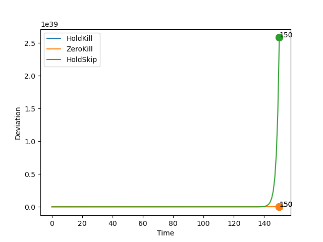
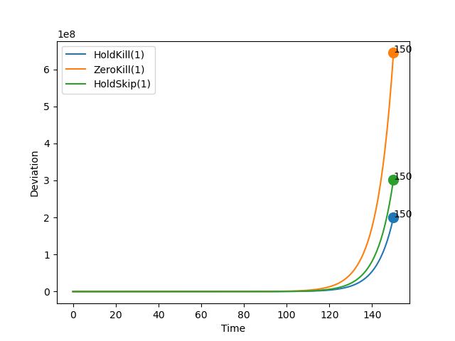
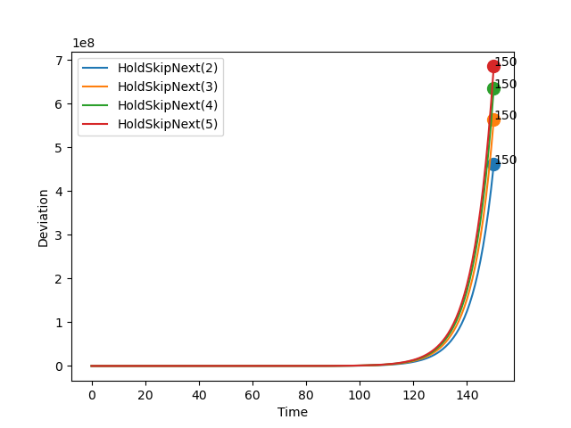
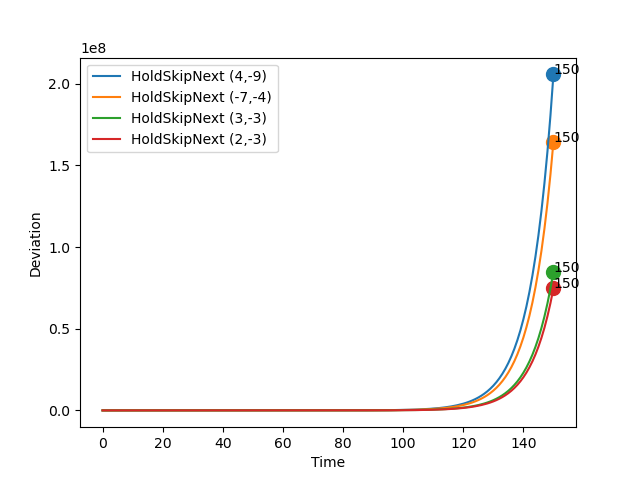

# Report: Steering

## Parameters

```sh
* Initial Set: [[10,10],[10,10]]
* Time Bound: 150
```

## Report: Using Uncertain Linear Systems

* Table



### Detailed Report

```sh
>> REPORT.	Method: ULS.	Policy:  HoldKill .
>> STATUS: Computing Reachable Sets . . .
	Time Taken:  8.421544551849365
>> STATUS: Reachable Sets Computed!
>> STATUS: Computing Deviations . . .
	Time Taken:  5.115340232849121
>> STATUS: Deviations Computed!
	Max Deviation:  7.609597282281613e+18 ;	 At time step:  150
	Total Time Taken:  13.558659076690674
>> End of Report!

-----------

>> REPORT.	Method: ULS.	Policy:  ZeroKill .
>> STATUS: Computing Reachable Sets . . .
	Time Taken:  7.262061834335327
>> STATUS: Reachable Sets Computed!
>> STATUS: Computing Deviations . . .
	Time Taken:  3.9925780296325684
>> STATUS: Deviations Computed!
	Max Deviation:  6641360.698514424 ;	 At time step:  150
	Total Time Taken:  11.256499767303467
>> End of Report!

-----------

>> REPORT.	Method: ULS.	Policy:  HoldSkipAny .
>> STATUS: Computing Reachable Sets . . .
	Time Taken:  27.807162761688232
>> STATUS: Reachable Sets Computed!
>> STATUS: Computing Deviations . . .
	Time Taken:  8.549302577972412
>> STATUS: Deviations Computed!
	Max Deviation:  2.5822333933482065e+39 ;	 At time step:  150
	Total Time Taken:  36.35882353782654
>> End of Report!

-----------
```

## Report: Using Generalized Recurrence Relations

* Table
* Max Deadline Miss: 1



### Detailed Report

```sh
>> REPORT.	Method: Recurrence Relation.	Policy:  HoldKill .	Max Deadline Miss:  1
>> STATUS: Computing Reachable Sets . . .
	Time Taken:  0.4273567199707031
>> STATUS: Reachable Sets Computed!
>> STATUS: Computing Deviations . . .
	Time Taken:  0.6126410961151123
>> STATUS: Deviations Computed!
	Max Deviation:  200641637.72217256 ;	 At time step:  150
	Total Time Taken:  1.0688707828521729
>> End of Report!

-----------

>> REPORT.	Method: Recurrence Relation.	Policy:  ZeroKill .	Max Deadline Miss:  1
>> STATUS: Computing Reachable Sets . . .
	Time Taken:  0.3740198612213135
>> STATUS: Reachable Sets Computed!
>> STATUS: Computing Deviations . . .
	Time Taken:  0.5566437244415283
>> STATUS: Deviations Computed!
	Max Deviation:  644430680.9656265 ;	 At time step:  150
	Total Time Taken:  0.9334359169006348
>> End of Report!

-----------

>> REPORT.	Method: Recurrence Relation.	Policy:  HoldSkipAny .	Max Deadline Miss:  1
>> STATUS: Computing Reachable Sets . . .
	Time Taken:  0.5057570934295654
>> STATUS: Reachable Sets Computed!
>> STATUS: Computing Deviations . . .
	Time Taken:  0.5716304779052734
>> STATUS: Deviations Computed!
	Max Deviation:  302324448.03611153 ;	 At time step:  150
	Total Time Taken:  1.0793497562408447
>> End of Report!

-----------
```

## Report: Using Generalized Recurrence Relations on Hold-Skip-Next Varying Misses

* Comparing the effect of deadline misses



### Detailed Report

```sh
>> REPORT.	Method: Recurrence Relation.	Policy:  HoldSkipAny .	Max Deadline Miss:  2
>> STATUS: Computing Reachable Sets . . .
	Time Taken:  0.4371788501739502
>> STATUS: Reachable Sets Computed!
>> STATUS: Computing Deviations . . .
	Time Taken:  0.812800407409668
>> STATUS: Deviations Computed!
	Max Deviation:  461142875.45803624 ;	 At time step:  150
	Total Time Taken:  1.2736663818359375
>> End of Report!

-----------

>> REPORT.	Method: Recurrence Relation.	Policy:  HoldSkipAny .	Max Deadline Miss:  3
>> STATUS: Computing Reachable Sets . . .
	Time Taken:  1.0349657535552979
>> STATUS: Reachable Sets Computed!
>> STATUS: Computing Deviations . . .
	Time Taken:  1.385068416595459
>> STATUS: Deviations Computed!
	Max Deviation:  563851552.8269018 ;	 At time step:  150
	Total Time Taken:  2.421886920928955
>> End of Report!

-----------

>> REPORT.	Method: Recurrence Relation.	Policy:  HoldSkipAny .	Max Deadline Miss:  4
>> STATUS: Computing Reachable Sets . . .
	Time Taken:  0.8201467990875244
>> STATUS: Reachable Sets Computed!
>> STATUS: Computing Deviations . . .
	Time Taken:  1.408278226852417
>> STATUS: Deviations Computed!
	Max Deviation:  635826285.0676223 ;	 At time step:  150
	Total Time Taken:  2.2303318977355957
>> End of Report!

-----------

>> REPORT.	Method: Recurrence Relation.	Policy:  HoldSkipAny .	Max Deadline Miss:  5
>> STATUS: Computing Reachable Sets . . .
	Time Taken:  0.9736456871032715
>> STATUS: Reachable Sets Computed!
>> STATUS: Computing Deviations . . .
	Time Taken:  1.660398244857788
>> STATUS: Deviations Computed!
	Max Deviation:  685158603.3660743 ;	 At time step:  150
	Total Time Taken:  2.636030435562134
>> End of Report!

-----------
```


## Report: Using Generalized Recurrence Relations on Hold-Skip-Next Varying Initial States

* Comparing the effect of initial sets.
* Max deadline: 1.



### Detailed Report

```sh
>> REPORT.	Method: Recurrence Relation.	Policy:  HoldSkipAny .	Max Deadline Miss:  1
>> STATUS: Computing Reachable Sets . . .
	Time Taken:  0.32189106941223145
>> STATUS: Reachable Sets Computed!
>> STATUS: Computing Deviations . . .
	Time Taken:  0.5322351455688477
>> STATUS: Deviations Computed!
	Max Deviation:  205672657.16906357 ;	 At time step:  150
	Total Time Taken:  0.876471757888794
>> End of Report!
Init Set:  4 , -9

-----------

>> REPORT.	Method: Recurrence Relation.	Policy:  HoldSkipAny .	Max Deadline Miss:  1
>> STATUS: Computing Reachable Sets . . .
	Time Taken:  0.3379971981048584
>> STATUS: Reachable Sets Computed!
>> STATUS: Computing Deviations . . .
	Time Taken:  0.5080099105834961
>> STATUS: Deviations Computed!
	Max Deviation:  164517429.8686378 ;	 At time step:  150
	Total Time Taken:  0.8478739261627197
>> End of Report!
Init Set:  -7 , -4

-----------

>> REPORT.	Method: Recurrence Relation.	Policy:  HoldSkipAny .	Max Deadline Miss:  1
>> STATUS: Computing Reachable Sets . . .
	Time Taken:  0.3551809787750244
>> STATUS: Reachable Sets Computed!
>> STATUS: Computing Deviations . . .
	Time Taken:  0.5116157531738281
>> STATUS: Deviations Computed!
	Max Deviation:  84997413.67302212 ;	 At time step:  150
	Total Time Taken:  0.8686394691467285
>> End of Report!
Init Set:  3 , -3

-----------

>> REPORT.	Method: Recurrence Relation.	Policy:  HoldSkipAny .	Max Deadline Miss:  1
>> STATUS: Computing Reachable Sets . . .
	Time Taken:  0.2938809394836426
>> STATUS: Reachable Sets Computed!
>> STATUS: Computing Deviations . . .
	Time Taken:  0.6516573429107666
>> STATUS: Deviations Computed!
	Max Deviation:  74810164.5427147 ;	 At time step:  150
	Total Time Taken:  0.9473989009857178
>> End of Report!
Init Set:  2 , -3

-----------
```

