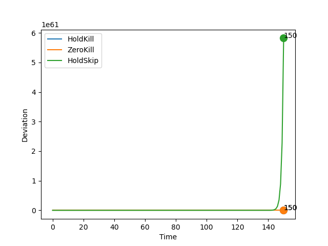
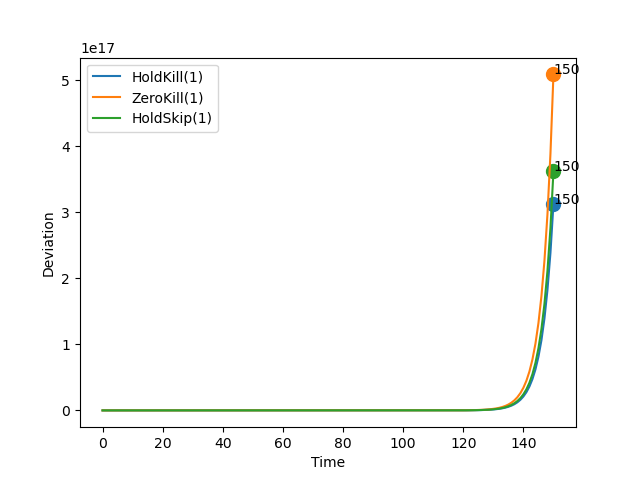
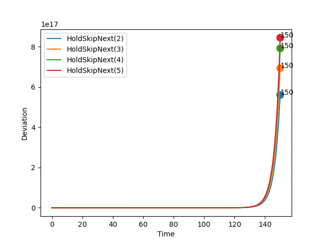
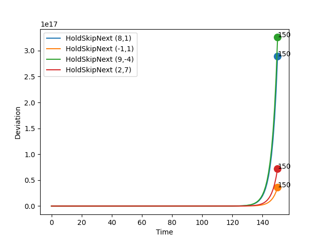

# Report: ECRTS-21

## Parameters

```sh
* Initial Set: [[10,10],[10,10]]
* Time Bound: 150
```

## Report: Using Uncertain Linear Systems

* Table



### Detailed Report

```sh
>> REPORT.	Method: ULS.	Policy:  HoldKill .
>> STATUS: Computing Reachable Sets . . .
	Time Taken:  7.463354587554932
>> STATUS: Reachable Sets Computed!
>> STATUS: Computing Deviations . . .
	Time Taken:  3.5951576232910156
>> STATUS: Deviations Computed!
	Max Deviation:  3.875431136410593e+22 ;	 At time step:  150
	Total Time Taken:  11.081182479858398
>> End of Report!

-----------

>> REPORT.	Method: ULS.	Policy:  ZeroKill .
>> STATUS: Computing Reachable Sets . . .
	Time Taken:  7.013054370880127
>> STATUS: Reachable Sets Computed!
>> STATUS: Computing Deviations . . .
	Time Taken:  3.6099441051483154
>> STATUS: Deviations Computed!
	Max Deviation:  167625734.65586782 ;	 At time step:  150
	Total Time Taken:  10.624862670898438
>> End of Report!

-----------

>> REPORT.	Method: ULS.	Policy:  HoldSkipAny .
>> STATUS: Computing Reachable Sets . . .
	Time Taken:  26.614306211471558
>> STATUS: Reachable Sets Computed!
>> STATUS: Computing Deviations . . .
	Time Taken:  8.100639581680298
>> STATUS: Deviations Computed!
	Max Deviation:  5.823056092780334e+61 ;	 At time step:  150
	Total Time Taken:  34.7172417640686
>> End of Report!

-----------
```

## Report: Using Generalized Recurrence Relations

* Table
* Max Deadline Miss: 1



### Detailed Report

```sh
>> REPORT.	Method: Recurrence Relation.	Policy:  HoldKill .	Max Deadline Miss:  1
>> STATUS: Computing Reachable Sets . . .
	Time Taken:  0.16168975830078125
>> STATUS: Reachable Sets Computed!
>> STATUS: Computing Deviations . . .
	Time Taken:  0.2966632843017578
>> STATUS: Deviations Computed!
	Max Deviation:  3.1261950018276934e+17 ;	 At time step:  150
	Total Time Taken:  0.4828829765319824
>> End of Report!

-----------

>> REPORT.	Method: Recurrence Relation.	Policy:  ZeroKill .	Max Deadline Miss:  1
>> STATUS: Computing Reachable Sets . . .
	Time Taken:  0.16863393783569336
>> STATUS: Reachable Sets Computed!
>> STATUS: Computing Deviations . . .
	Time Taken:  0.2822549343109131
>> STATUS: Deviations Computed!
	Max Deviation:  5.08905854381013e+17 ;	 At time step:  150
	Total Time Taken:  0.45247530937194824
>> End of Report!

-----------

>> REPORT.	Method: Recurrence Relation.	Policy:  HoldSkipAny .	Max Deadline Miss:  1
>> STATUS: Computing Reachable Sets . . .
	Time Taken:  0.2671947479248047
>> STATUS: Reachable Sets Computed!
>> STATUS: Computing Deviations . . .
	Time Taken:  0.4993150234222412
>> STATUS: Deviations Computed!
	Max Deviation:  3.6197517195779014e+17 ;	 At time step:  150
	Total Time Taken:  0.7682950496673584
>> End of Report!

-----------
```

## Report: Using Generalized Recurrence Relations on Hold-Skip-Next Varying Misses

* Comparing the effect of deadline misses



### Detailed Report

```sh
>> REPORT.	Method: Recurrence Relation.	Policy:  HoldSkipAny .	Max Deadline Miss:  2
>> STATUS: Computing Reachable Sets . . .
	Time Taken:  0.3958289623260498
>> STATUS: Reachable Sets Computed!
>> STATUS: Computing Deviations . . .
	Time Taken:  0.7790718078613281
>> STATUS: Deviations Computed!
	Max Deviation:  5.604461570947084e+17 ;	 At time step:  150
	Total Time Taken:  1.1970632076263428
>> End of Report!

-----------

>> REPORT.	Method: Recurrence Relation.	Policy:  HoldSkipAny .	Max Deadline Miss:  3
>> STATUS: Computing Reachable Sets . . .
	Time Taken:  0.5468177795410156
>> STATUS: Reachable Sets Computed!
>> STATUS: Computing Deviations . . .
	Time Taken:  1.0431251525878906
>> STATUS: Deviations Computed!
	Max Deviation:  6.955645234547644e+17 ;	 At time step:  150
	Total Time Taken:  1.5917682647705078
>> End of Report!

-----------

>> REPORT.	Method: Recurrence Relation.	Policy:  HoldSkipAny .	Max Deadline Miss:  4
>> STATUS: Computing Reachable Sets . . .
	Time Taken:  0.6767368316650391
>> STATUS: Reachable Sets Computed!
>> STATUS: Computing Deviations . . .
	Time Taken:  1.3118624687194824
>> STATUS: Deviations Computed!
	Max Deviation:  7.926570499514811e+17 ;	 At time step:  150
	Total Time Taken:  1.9903881549835205
>> End of Report!

-----------

>> REPORT.	Method: Recurrence Relation.	Policy:  HoldSkipAny .	Max Deadline Miss:  5
>> STATUS: Computing Reachable Sets . . .
	Time Taken:  0.8063147068023682
>> STATUS: Reachable Sets Computed!
>> STATUS: Computing Deviations . . .
	Time Taken:  1.5958516597747803
>> STATUS: Deviations Computed!
	Max Deviation:  8.446945480518207e+17 ;	 At time step:  150
	Total Time Taken:  2.403914451599121
>> End of Report!

-----------
```


## Report: Using Generalized Recurrence Relations on Hold-Skip-Next Varying Initial States

* Comparing the effect of initial sets.
* Max deadline: 1.



### Detailed Report

```sh
>> REPORT.	Method: Recurrence Relation.	Policy:  HoldSkipAny .	Max Deadline Miss:  1
>> STATUS: Computing Reachable Sets . . .
	Time Taken:  0.321455717086792
>> STATUS: Reachable Sets Computed!
>> STATUS: Computing Deviations . . .
	Time Taken:  0.6102266311645508
>> STATUS: Deviations Computed!
	Max Deviation:  2.894864698778919e+17 ;	 At time step:  150
	Total Time Taken:  0.9539368152618408
>> End of Report!
Init Set:  8 , 1

-----------

>> REPORT.	Method: Recurrence Relation.	Policy:  HoldSkipAny .	Max Deadline Miss:  1
>> STATUS: Computing Reachable Sets . . .
	Time Taken:  0.3075523376464844
>> STATUS: Reachable Sets Computed!
>> STATUS: Computing Deviations . . .
	Time Taken:  0.5742754936218262
>> STATUS: Deviations Computed!
	Max Deviation:  3.619843375831907e+16 ;	 At time step:  150
	Total Time Taken:  0.883885383605957
>> End of Report!
Init Set:  -1 , 1

-----------

>> REPORT.	Method: Recurrence Relation.	Policy:  HoldSkipAny .	Max Deadline Miss:  1
>> STATUS: Computing Reachable Sets . . .
	Time Taken:  0.3084239959716797
>> STATUS: Reachable Sets Computed!
>> STATUS: Computing Deviations . . .
	Time Taken:  0.649634838104248
>> STATUS: Deviations Computed!
	Max Deviation:  3.2560370048366496e+17 ;	 At time step:  150
	Total Time Taken:  0.9600763320922852
>> End of Report!
Init Set:  9 , -4

-----------

>> REPORT.	Method: Recurrence Relation.	Policy:  HoldSkipAny .	Max Deadline Miss:  1
>> STATUS: Computing Reachable Sets . . .
	Time Taken:  0.3292818069458008
>> STATUS: Reachable Sets Computed!
>> STATUS: Computing Deviations . . .
	Time Taken:  0.5834314823150635
>> STATUS: Deviations Computed!
	Max Deviation:  7.257648674531594e+16 ;	 At time step:  150
	Total Time Taken:  0.9151253700256348
>> End of Report!
Init Set:  2 , 7

-----------
```

