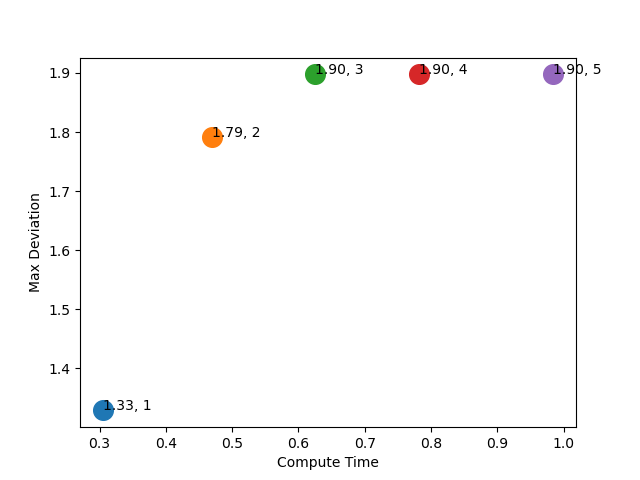

# Case Study: RC

## Differences with Stability

```python
initSet=[(10,10),(10,10)],
T=150,
methodName="ZeroKill",
maxDeadline=3,
safeDev=1.92
```

```shell
ULS time taken:  6.055886268615723 ; 	
FSM time taken:  0.786625862121582
	
ULS max dev:  1.9714503127201366 ; 	
FSM time taken:  1.8975665908289183
```

* Why was only _"Zero&Kill"_ used?
  * ULS diverges for other policies (even with 1 deadline miss).
  * FSM computes same max dev. for all policies with 3 deadline misses
* Why 3 deadline misses?
  * Impact of other number of deadline misses will be shown later. Here we focus on safety.

### Method: ULS

```shell
STATUS: Unsafe
```


### Method: FSM

```shell
STATUS: Safe
```


## Scalability

```python
initSet=[(10,10),(10,10)],
methodName="ZeroKill"
```

### Varying Time Horizon

#### Method: ULS


#### Method: FSM


### Varying Deadline Misses

#### Method: ULS


#### Method: FSM


